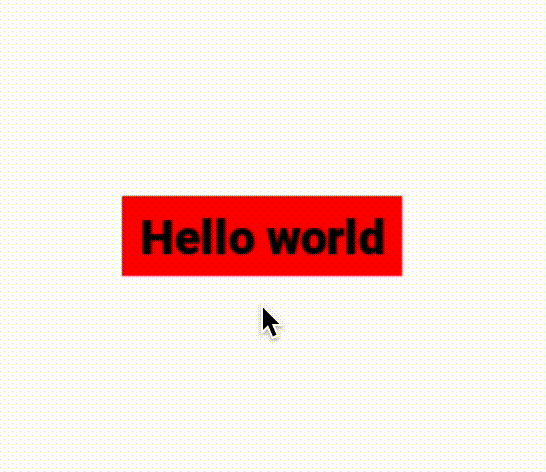

# XSUI - Xfajk's SDL User Interface

XSUI (Xfajk's SDL User Interface) is a powerful and versatile library designed for creating graphical user interfaces (GUI) and interactive applications using the Simple DirectMedia Layer (SDL2) as its foundation. Whether you're developing games, multimedia applications, or any software that requires a user interface, XSUI provides the tools you need to craft beautiful, user-friendly experiences.

## Key Features

- **User-Friendly**: XSUI simplifies the process of creating GUIs and interactive applications, allowing developers to focus on design and functionality.

- **Cross-Platform**: XSUI supports multiple platforms, including Windows, macOS, and Linux, making it suitable for developing software across various operating systems.

- **SDL2 Integration**: Compatible with SDL2, XSUI seamlessly integrates with existing SDL2 projects, enhancing them with a polished GUI.

- **Versatile Rendering**: Render UI elements, text, basic shapes, and more, giving you complete control over the visual aspects of your application.

- **Upcoming Features**: XSUI continues to evolve, with planned support for image rendering and sound playback to take your applications to the next level.

## Getting Started

To incorporate XSUI into your project, follow these steps:

1. **Installation**: [Install XSUI](https://github.com/XFajk/XSUI-lib/wiki/Installation-Guide) by including it in your project, ensuring you have SDL2 and other required dependencies.

2. **Tutorials**: Explore our [tutorials](link-to-tutorials) for comprehensive guidance on using XSUI to create your applications and UIs.

3. **Documentation**: For detailed information on the library's features and how to use them, refer to our [documentation](https://github.com/XFajk/XSUI-lib/wiki).

## Installation

XSUI is easy to install and integrate into your project. Follow the steps in our [Installation Guide](https://github.com/XFajk/XSUI-lib/wiki/Installation-Guide) to get started quickly.

## Documentation

Our comprehensive [documentation](https://github.com/XFajk/XSUI-lib/wiki) provides in-depth information about XSUI's functions, structures, and best practices. It's a valuable resource for both beginners and experienced developers.

## Compatibility

XSUI is designed to be compatible with SDL2, making it a valuable addition to your existing SDL2 projects. Enhance your applications with a visually appealing and intuitive user interface without any hassle.

## Contribution and Support

XSUI is an open-source project, and we welcome contributions from the community. If you encounter issues or have suggestions for improvements, please [report them](https://github.com/XFajk/XSUI-lib/issues) on our GitHub repository. Your support is essential for making XSUI even better!

Get started with XSUI today and create exceptional user interfaces and interactive applications effortlessly. Happy coding!
